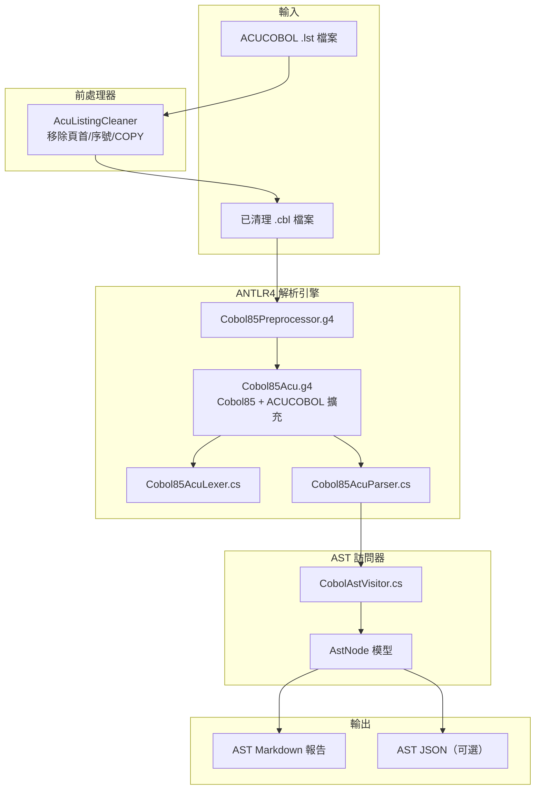

# ANTLR4 C# COBOL-to-AST 轉換方案

> 更新時間：2026-02-06
> 摘要：保存自 Cursor 專案計畫

## 背景與現況分析

目前專案有兩套工具：

- **Java/Maven (ProLeap)**: 可解析 DATA DIVISION，但 PROCEDURE DIVISION 因 ACUCOBOL 特有語法（CREATE/MODIFY/INQUIRE/DESTROY GUI 語句、ASSIGN TO DISK 等）無法建構 ASG，語句統計為 0
- **C# ConvertCobol**: 有自訂 `ACUCOBOL.g4` 但極度簡化（僅 143 行），只支援基本 MOVE/DISPLAY/CALL，無法處理真實檔案

**HRRCB1IF.cbl 特徵**（20,576 行）：

- 72 個 FD 定義、79 個 01-Level、15,246 個資料項目
- PROCEDURE DIVISION 約 4,444 行（第 16,132 行起）
- 90+ 個 GUI 操作語句（CREATE/MODIFY/INQUIRE/DESTROY/DISPLAY STATUS-BAR）
- ACUCOBOL 擴充：ASSIGN TO DISK、WITH COMPRESSION、LOCK MANUAL、COMPRESSION CONTROL VALUE
- `{Bench}` / `{TAMIS}` 標記、中文註解（MS950 編碼）

## 方案架構



## 技術選型

| 項目            | 選擇                                     | 理由                                 |
| ------------- | -------------------------------------- | ---------------------------------- |
| 框架            | .NET 8 (SDK-style)                     | 現代化、跨平台、取代 .NET Framework 4.6.2    |
| ANTLR Runtime | `Antlr4.Runtime.Standard` 4.13.1       | 官方 C# runtime，支援 .NET Standard 2.0 |
| ANTLR 建置      | `Antlr4BuildTasks` NuGet               | 編譯時自動從 .g4 產生 C#                   |
| 基礎文法          | `antlr/grammars-v4/cobol85/Cobol85.g4` | 通過 NIST 測試、銀行/保險實戰驗證               |
| AST 走訪        | Visitor 模式                             | 比 Listener 更靈活，可控制子樹走訪             |

## 專案結構規劃

```
ConvertCobol/
├── ConvertCobol.csproj          # .NET 8 SDK-style 專案檔
├── Program.cs                   # 主程式進入點
├── Grammar/
│   ├── Cobol85Preprocessor.g4   # 前處理器文法（COPY/REPLACE）
│   ├── Cobol85Acu.g4            # 主文法 = Cobol85 + ACUCOBOL 擴充
│   └── README.md                # 文法修改說明
├── Preprocessing/
│   └── AcuListingCleaner.cs     # .lst → .cbl 清理（移植自 Java 版）
├── Models/
│   ├── AstNode.cs               # AST 節點基類
│   ├── DivisionNode.cs          # IDENTIFICATION/ENVIRONMENT/DATA/PROCEDURE
│   ├── DataItemNode.cs          # 資料項目（PIC、OCCURS、REDEFINES）
│   ├── StatementNode.cs         # 語句節點（MOVE、CALL、IF 等）
│   └── ParagraphNode.cs         # 段落/區段節點
├── Visitors/
│   ├── CobolAstVisitor.cs       # ANTLR parse tree → AstNode 模型
│   └── AstStatisticsVisitor.cs  # 統計分析訪問器
├── Reporters/
│   ├── MarkdownAstReporter.cs   # AstNode → Markdown 輸出
│   └── JsonAstReporter.cs       # AstNode → JSON 輸出（可選）
└── Generated/                   # ANTLR 自動產生（gitignore）
    ├── Cobol85AcuLexer.cs
    ├── Cobol85AcuParser.cs
    ├── Cobol85AcuBaseVisitor.cs
    └── ...
```

## 核心實作細節

### 1. 文法擴充策略

以官方 `Cobol85.g4` 為基底，新增 ACUCOBOL-GT 擴充規則：

```antlr
// ACUCOBOL 檔案控制擴充
assignClause
    : ASSIGN TO? (DISK | DISPLAY | PRINT)? assignmentName
    ;

// ACUCOBOL 壓縮控制
compressionClause
    : WITH? COMPRESSION (COMPRESSION CONTROL VALUE integerLiteral)?
    ;

// ACUCOBOL LOCK 模式
lockModeClause
    : LOCK MODE? IS? (MANUAL | AUTOMATIC | EXCLUSIVE)
    ;

// ACUCOBOL GUI 語句（PROCEDURE DIVISION）
createStatement
    : CREATE identifier (guiPropertyList)? (HANDLE IN? identifier)?
    ;
modifyStatement
    : MODIFY identifier (guiPropertyList)?
    ;
inquireStatement
    : INQUIRE identifier (guiPropertyList)?
    ;
destroyStatement
    : DESTROY identifier
    ;

// GUI 屬性清單
guiPropertyList
    : guiProperty (COMMA? guiProperty)*
    ;
guiProperty
    : identifier (IS? | '=')? (identifier | literal | '(' expression ')')
    ;
```

### 2. 前處理 (AcuListingCleaner.cs)

移植現有 Java 版 `AcuListingCleaner.java` 的邏輯：

- 移除頁首標頭（ACUCOBOL-GT...Page:）
- Strip 前 7 字元序號區
- COPY 語句註解化
- `$` 指令註解化
- SCREEN SECTION 處理
- `{Bench}` / `{TAMIS}` 標記處理

### 3. AST Visitor 核心邏輯

```csharp
public class CobolAstVisitor : Cobol85AcuBaseVisitor<AstNode>
{
    public override AstNode VisitCompilationUnit(...)
    {
        // 走訪四大 DIVISION，建構 AST 樹
    }
    
    public override AstNode VisitDataDescriptionEntry(...)
    {
        // 提取 level-number、PIC、OCCURS、REDEFINES、VALUE
    }
    
    public override AstNode VisitProcedureDivision(...)
    {
        // 走訪 Sections → Paragraphs → Sentences → Statements
    }
    
    // ACUCOBOL GUI 擴充
    public override AstNode VisitCreateStatement(...) { ... }
    public override AstNode VisitModifyStatement(...) { ... }
}
```

### 4. Markdown 報告產出

輸出格式對齊現有 `HRRCB1IF_ast.md` 格式，但增強 PROCEDURE DIVISION 部分：

- 概覽統計（FD、資料項目、Sections、Paragraphs、語句數）
- DATA DIVISION 完整結構
- **PROCEDURE DIVISION 完整解析**（目前 ProLeap 版無法做到）
  - Section/Paragraph 列表
  - 每個段落的語句統計
  - CALL 相依圖
  - GUI 操作統計

## 與現有 Java 方案的比較

| 面向                 | Java/ProLeap   | C#/ANTLR 新方案                  |
| ------------------ | -------------- | ----------------------------- |
| DATA DIVISION      | 完整             | 完整                            |
| PROCEDURE DIVISION | 無法解析（0 語句）     | 目標：完整解析                       |
| ACUCOBOL 語法        | 部分支援、容錯跳過      | 原生支援                          |
| GUI 語句             | 不支援            | CREATE/MODIFY/INQUIRE/DESTROY |
| 可維護性               | 依賴 ProLeap 第三方 | 自主控制文法                        |
| 部署                 | 需 JDK 17       | .NET 8 單檔發布                   |

## 風險與緩解

- **文法複雜度**: Cobol85.g4 約 6000+ 行，擴充需謹慎。緩解：漸進式加入 ACUCOBOL 規則，每次擴充都用 HRRCB1IF.cbl 驗證
- **中文編碼**: MS950/Big5 字元在 ANTLR lexer 中需特殊處理。緩解：前處理階段轉 UTF-8
- **效能**: 20,000+ 行檔案的 parse 時間。緩解：ANTLR4 的 SLL 預測模式效能良好
- **語法覆蓋率**: 初版無法 100% 覆蓋所有 ACUCOBOL 語法。緩解：啟用 error recovery，逐步擴充
